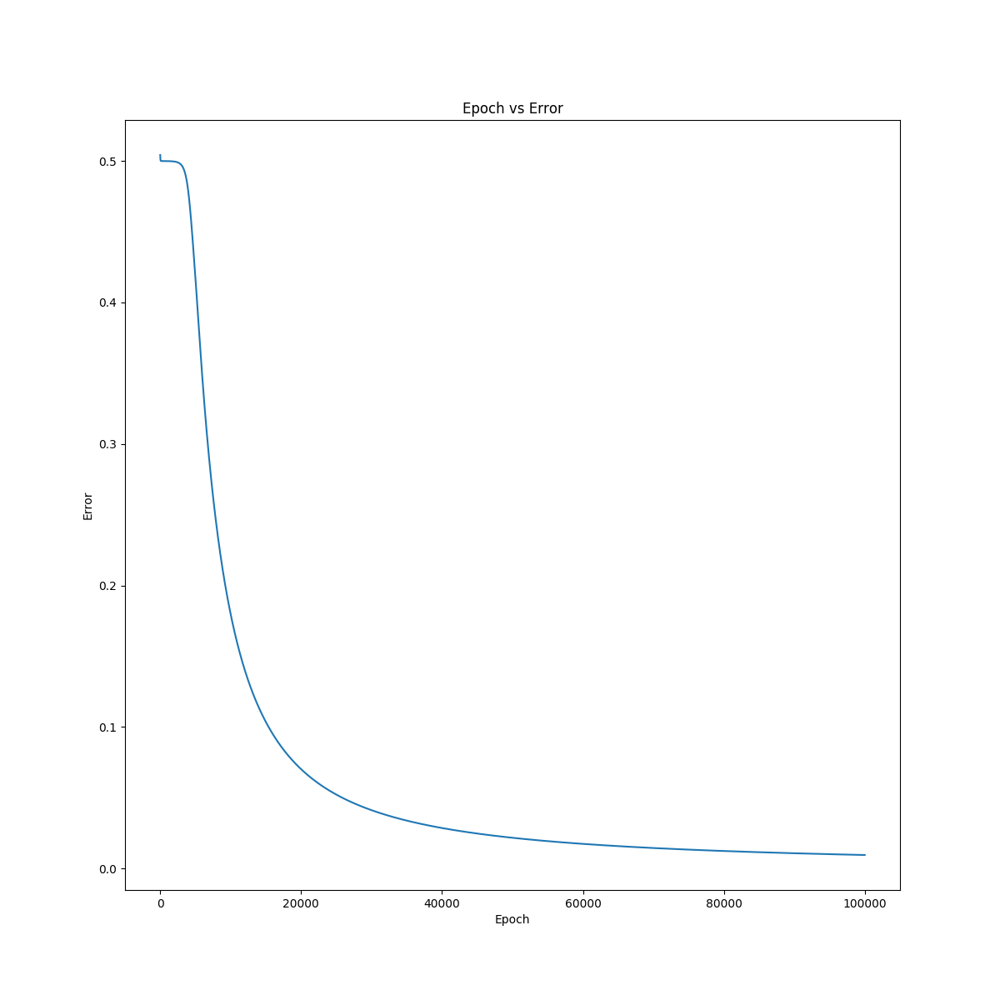

# neural-net-xor

After reading chapter 6 of the [deep learning book](https://www.deeplearningbook.org/), I decided to implement a scratch xor neural net to put into practice some of what I've learned.

### Setup
* `python3 -m venv .venv`
* `pip install -r requirements.txt`
* `python src/xor_nn.py`

### Results

